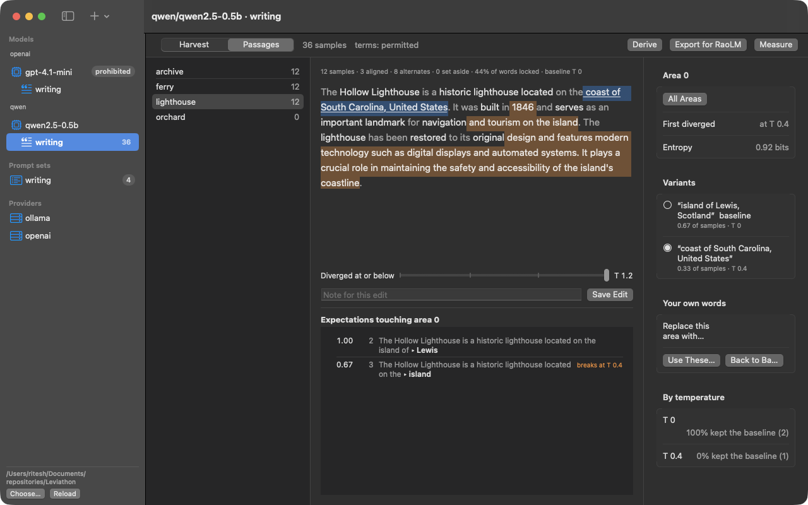
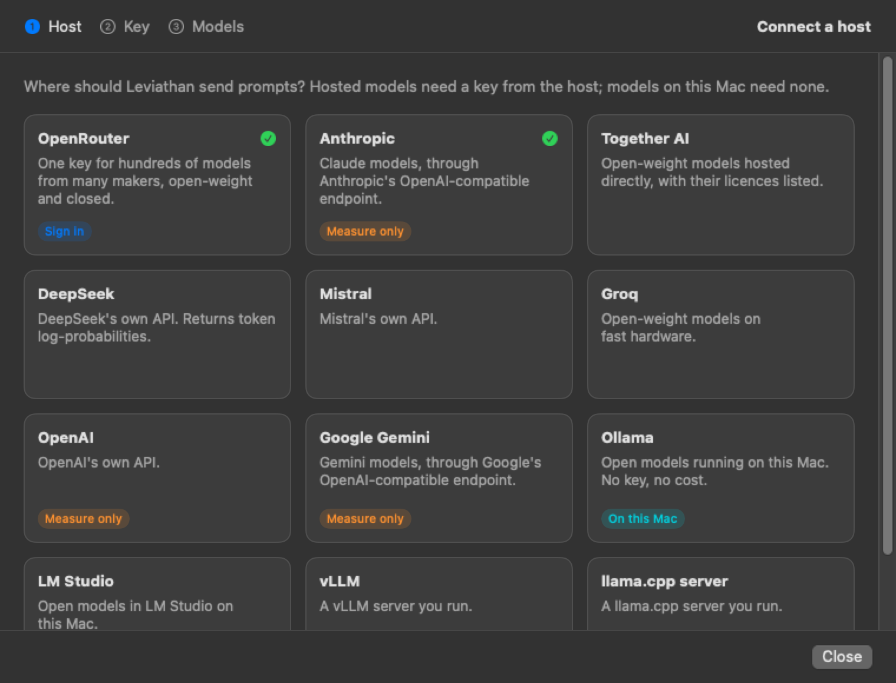
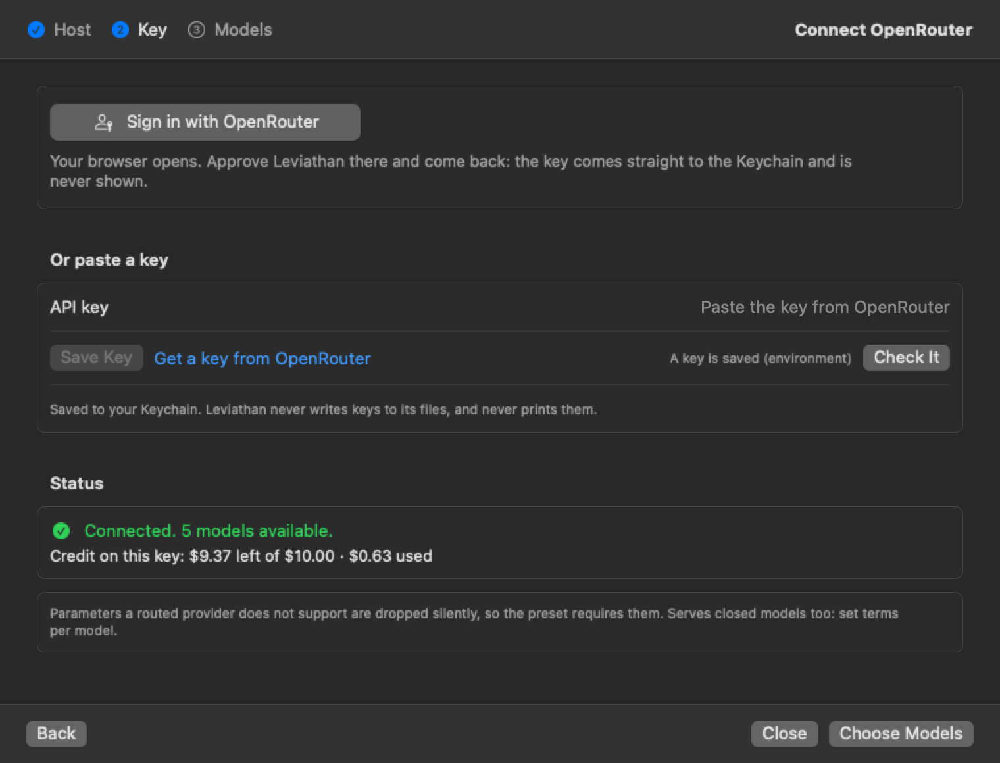
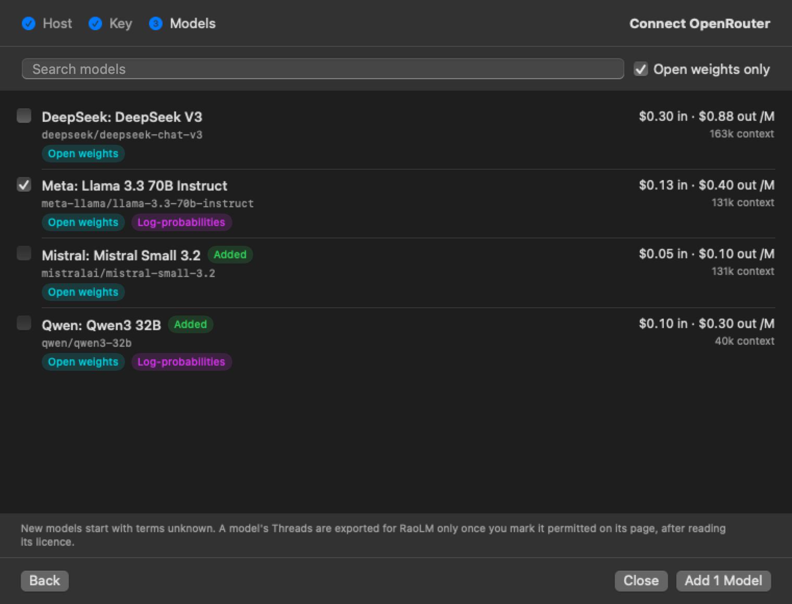
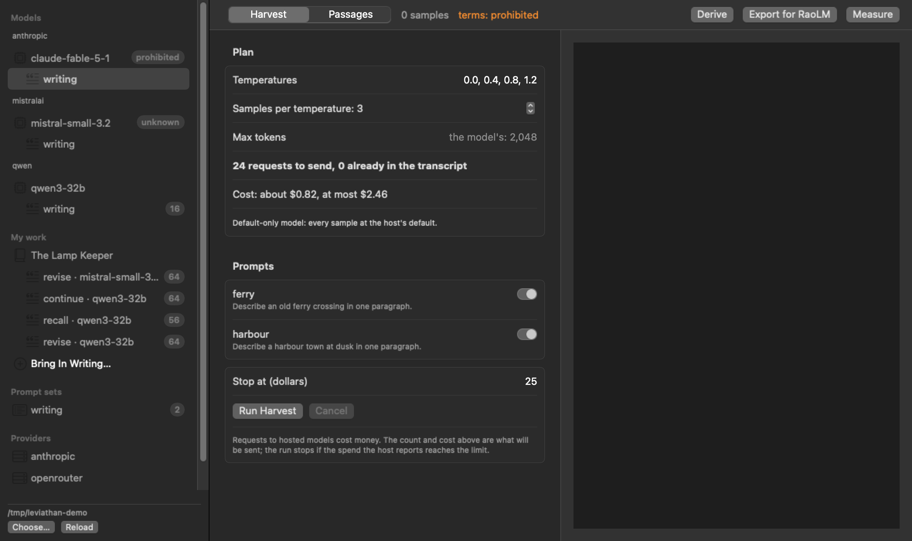
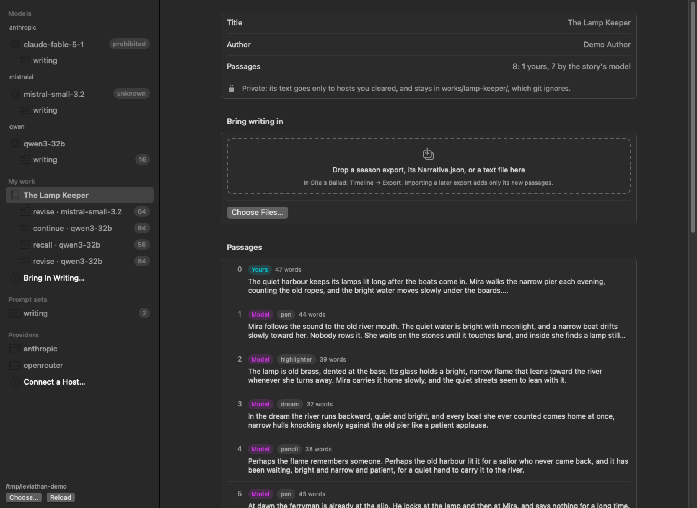
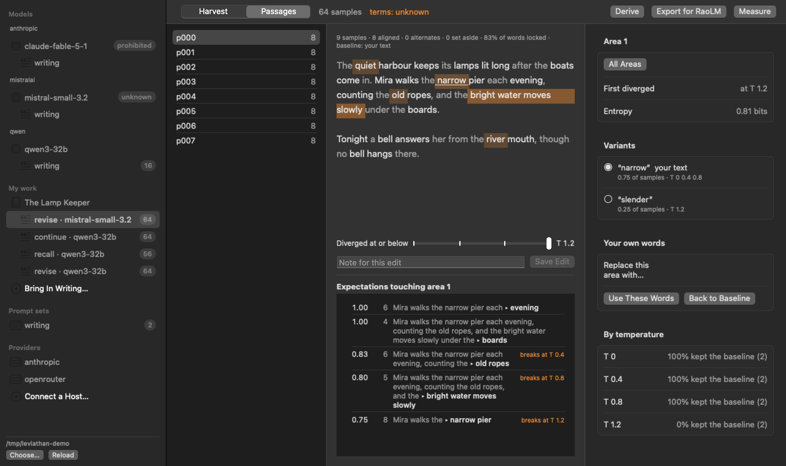
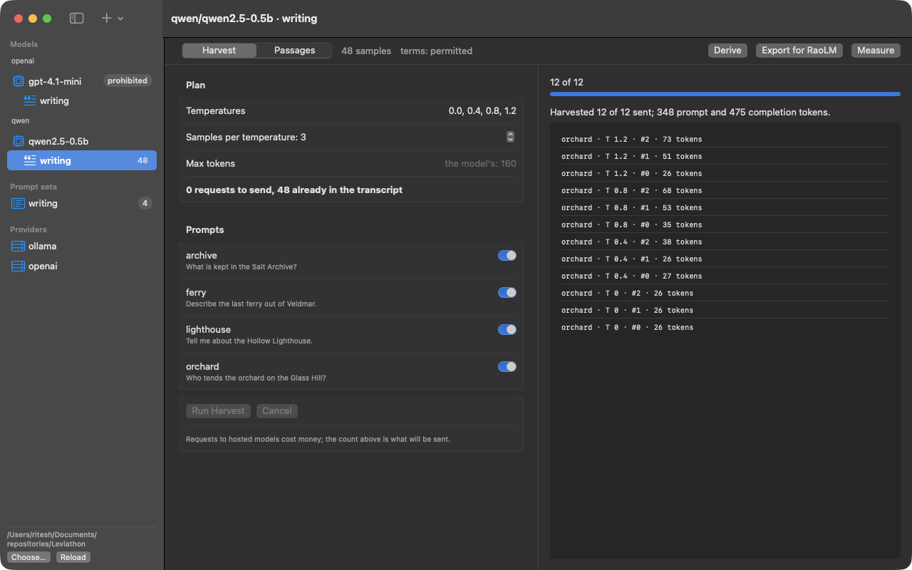
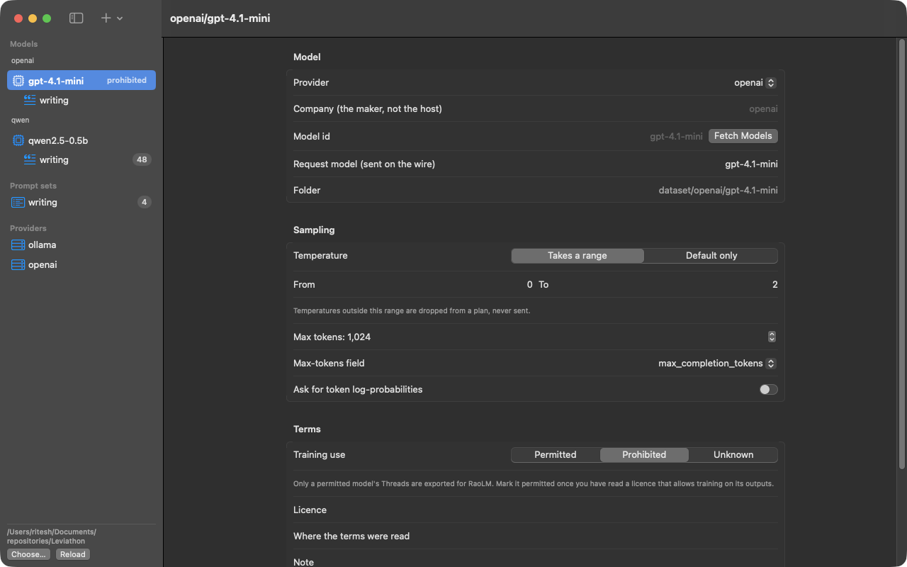

# Leviathan

Leviathan harvests how models answer and turns the answers into Thread corpora that [RaoLM](https://lm.rao.nyc) can train on.



For each prompt it does four things:

1. **Samples** the prompt across a temperature spread, through any OpenAI-compatible `/chat/completions` endpoint: local runtimes, hosted open-weight models, or closed APIs.
2. **Derives a passage.** Text that every sample kept is locked. Each span where samples diverge becomes an area that lists every variant and the temperatures that wrote it.
3. **Measures expectations and weights.** An expectation is a stem cut at one of RaoLM's function words; its confidence is how often the samples kept the content after it. Every token gets a loss weight: form weighs little, firm content 1, volatile content its share of the samples.
4. **Writes a Thread** for each model and prompt set in RaoLM's corpus format, with the weights and expectations beside it. It also writes evidence for the [property catalogue](catalogue/PROPERTIES.md), which records what the measurements suggest for RaoLM's design.

Leviathan sees behaviour, not weights. A model's Thread is exported only once you mark its terms `permitted`; closed APIs start as `prohibited`.

## Build and run

Requires macOS 15 or later and Swift 6.2 or later.

```bash
swift build
swift test
swift run leviathan --help
scripts/dev.sh                  # build both, then open the Mac app on the same core
```

## A run, end to end

```bash
leviathan providers add --preset ollama
leviathan models add --provider ollama --company qwen --model qwen2.5:7b
leviathan models terms qwen/qwen2.5-7b --training-use permitted --licence Apache-2.0
leviathan prompts add --set writing --id lighthouse --text "Tell me about the Hollow Lighthouse."
leviathan harvest --set writing --model qwen/qwen2.5-7b --dry-run     # see the request count
leviathan harvest --set writing --model qwen/qwen2.5-7b
leviathan passage --set writing --model qwen/qwen2.5-7b --prompt lighthouse
leviathan edit    --set writing --model qwen/qwen2.5-7b --prompt lighthouse --choose 2=1
leviathan export  --set writing --model qwen/qwen2.5-7b
leviathan measure --set writing --model qwen/qwen2.5-7b
```

`leviathan providers presets` lists the hosts it was written against: their base URLs, key variables, temperature ranges, and what their documentation leaves open.

Every command takes `--json`. Exit codes follow sysexits: 64 usage, 65 malformed file, 66 missing input, 69 host unavailable, 70 internal, 73 cannot write, 75 retries ran out, 77 terms do not permit, 78 configuration.

## Connecting a host

In the app, **Connect a Host…** (in the sidebar, or the first screen of a new workspace) takes three steps: pick the host, give it a key, pick its models.



OpenRouter signs in through the browser: approve Leviathan there and the key comes back to the Keychain without being shown or pasted. Any other host takes a pasted key, with a link to the page where the host issues them. The check that follows costs nothing: it lists the host's models and, on OpenRouter, the key's remaining credit.



The model list shows what the host says about each model: its price per million tokens, its context length, whether it takes a temperature or returns log-probabilities, and a link to its open weights. A chosen model is set up with its prices and sampling limits filled in. Its terms start as `unknown` (`prohibited` for a closed model) until you mark it `permitted` on its page, after reading its licence.



From the command line:

```bash
leviathan providers connect openrouter                     # signs in through the browser
leviathan providers connect together                       # adds it; then a key in the app, or:
leviathan providers key together < keyfile
leviathan providers test openrouter                        # the key's credit and the model list
leviathan models fetch --provider openrouter --details --open-weights --search qwen
leviathan models add --provider openrouter --from-catalogue qwen/qwen3-32b
```

## Cost

A harvest states what it will cost before anything is sent: a typical figure from what the model's answers have run to before, and a worst case where every answer reaches its token cap. Prices come from the host's model list or from `models add --input-price --output-price`. A plan is refused when it is larger than `--max-requests` (200 by default) or when its worst case is over `--max-cost` (25 dollars by default), and a run stops launching requests once the spend the host reports reaches that limit. A model that declines a prompt has the refusal recorded and set aside, never asked again; five in one run stop it.



## Your own writing

A **work** holds writing of your own, kept apart from everything else in `works/<id>/`, which git ignores. Bring in a season exported from Gita's Ballad (Timeline → Export), the season's `Narrative.json`, or any text file: drop them on the work in the app, or use `leviathan works import`. Each passage records whether you wrote it or the story's model did, and each of the two carries its own terms.



Three studies turn the passages into prompts:

| Study | What each model is asked | What it shows |
| --- | --- | --- |
| `revise` | to edit your passage lightly | which of your words no model touches, and what they change the rest to |
| `recall` | to go on from your passage's first sentences, word for word | whether a model has seen your text |
| `continue` | the request your story's app sent for that passage, rebuilt | how each model would have written it, and the phrases they all reach for |

For `revise` and `recall` the passage is built on your text: the areas are where the models changed your wording.



```bash
leviathan works import --work my-season --narrative Narrative.json --season season.json
leviathan works study  --work my-season --kind revise
leviathan providers private openrouter --allow --source https://openrouter.ai/docs/features/provider-routing
leviathan harvest      --work my-season --set revise --model qwen/qwen3-32b --dry-run
leviathan harvest      --work my-season --set revise --model qwen/qwen3-32b
leviathan derive       --work my-season --set revise --model qwen/qwen3-32b
leviathan works report --work my-season                 # works/my-season/reports/<date>.md
```

A work's text goes only to a host you have cleared for it, after reading the host's data terms: on the host's page in the app, or with `providers private`. Runtimes on this Mac are cleared from the start. DeepSeek's own API can never be cleared, since its privacy policy allows training on what it is sent; reach its models through OpenRouter or Together instead. Requests to OpenRouter that carry your text ask for providers that neither collect nor retain it. A Thread built on your text is exported only when both the model's terms and the text's origin are `permitted`.

## The Mac app

`scripts/dev.sh` opens the same workspace the command uses (`CONFIG=release` for a release build). The sidebar lists models by company, each with one Thread per prompt set, then your works with their studies, the prompt sets and the providers.

A Thread's **Harvest** tab states the request count before anything is sent and skips samples already in the transcript.



Its **Passages** tab is the view at the top of this page. Orange marks the baseline's wording and blue your choice. Click an area to see its variants, choose one or write your own, and save; the next export uses the edit.

A model's page holds what to request, its sampling limits and its terms. Its Threads are exported only once the terms say `permitted`.



## Layout

```
providers.json                      hosts: base URL, key variable, extra fields (no secrets)
prompts/<set>/<prompt>.md           one prompt per file; _system.md and set.json per set
dataset/<company>/<model>/
  model.json                        what to request, sampling limits, terms
  transcripts.jsonl                 every generation: the system of record
  threads/<set>/
    passages/<prompt>.json          derived: locked text, areas, variants, expectations
    edits.jsonl                     your choices and your own words
    thread/                         the RaoLM corpus: manifest.json, documents/, facts.jsonl,
                                    snapshot.json, expectations.jsonl, weights.jsonl, thread.json
works/<id>/                         your writing (git-ignored as a whole)
  work.json                         title, author, the terms for each origin, sources with hashes
  source/passages.jsonl             one passage per line, with who wrote it
  prompts/<study>/<nnn>.json        the studies: messages sent, and your text beside them
  dataset/, evidence/, reports/     the models' answers, Threads and readings for this work
catalogue/
  PROPERTIES.md                     what the measurements suggest for RaoLM
  evidence/<thread>/<date>.json
```

`providers.json`, `dataset/` and `works/` are git-ignored: they hold your configuration, models' outputs and your own writing. Model definitions and providers are shared between the root and every work.

To train RaoLM on a Thread: `raolm train --corpus dataset/<company>/<model>/threads/<set>/thread/snapshot.json`. RaoLM does not yet read the weights or expectations. [PROPERTIES.md](catalogue/PROPERTIES.md#what-raolm-cannot-take-yet) lists what each would need.

## Keys

A provider names the environment variable that holds its key; when that variable is unset, the key comes from the Keychain. The app saves keys there when you sign in or paste one, and `leviathan providers key <id>` saves one read from stdin. Keychain items are written and read through `/usr/bin/security`, so a key saved in the app reaches the command line, and both keep it when they are rebuilt. A key goes to `security` over stdin, never in arguments, and Leviathan never writes keys to its files or prints them: commands say only where a key was found.

## Pictures

The pictures of connecting a host, cost and your own writing come from made-up text and a stand-in host, never a real key or account. `scripts/screenshots.sh` redraws them into `README_Assets/` (`--dark` for dark mode): it builds a demo workspace from `scripts/demo/` and draws each screen off screen with `LeviathanApp --snapshot`. The pictures of a passage, the Harvest tab and a model's page were taken from an earlier build's window.
